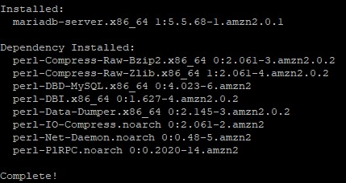
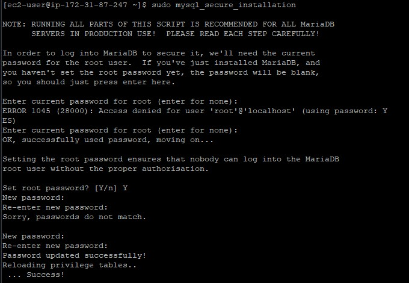
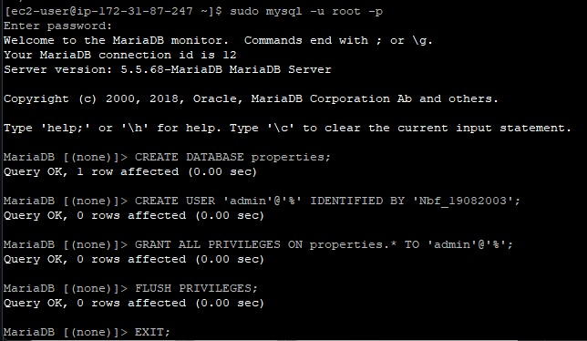
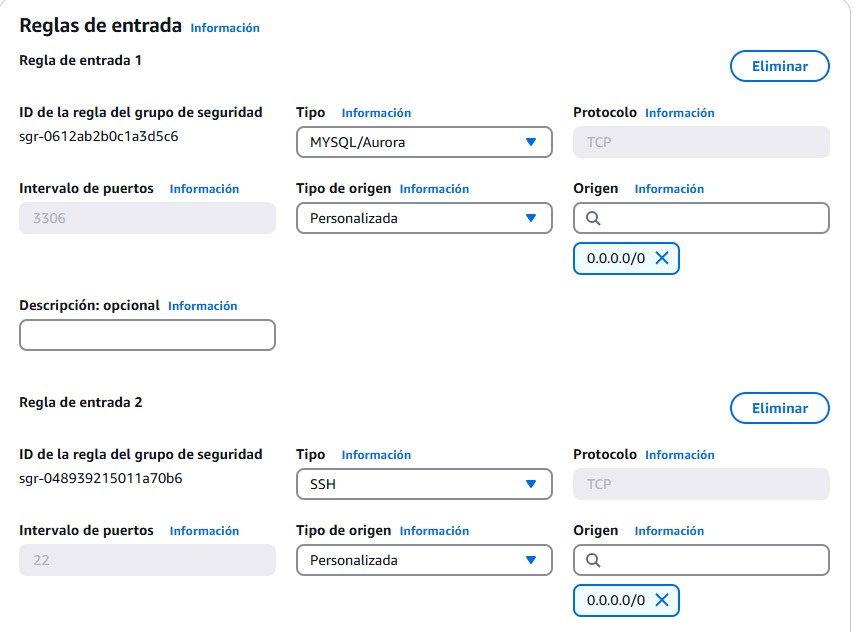
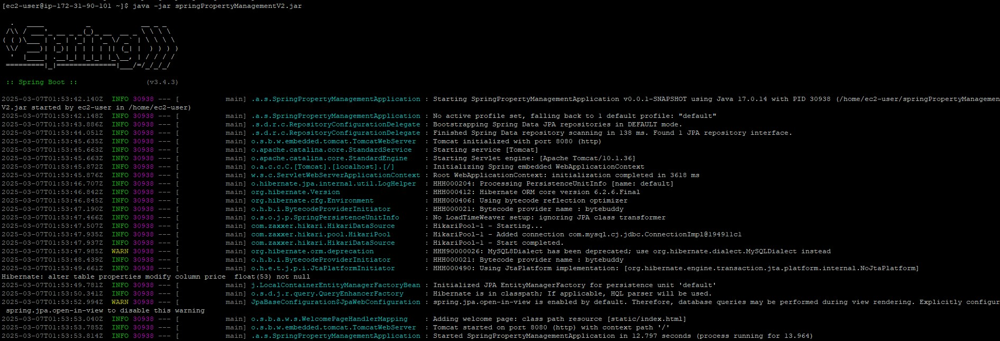
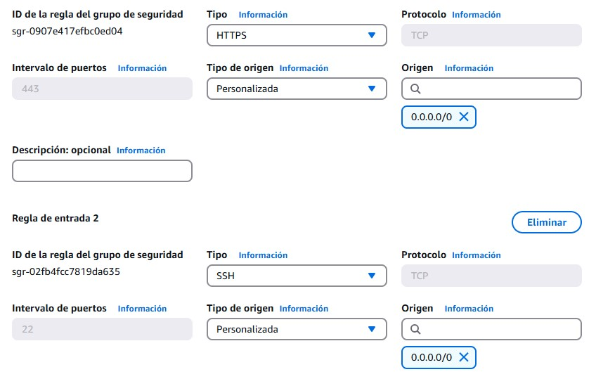
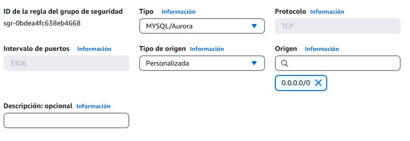
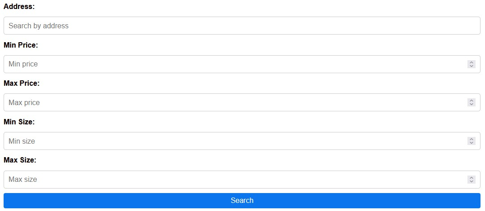

# SISTEMA CRUD PARA MANEJAR PROPIEDADES

Este proyecto consiste en el desarrollo de un sistema CRUD (Crear, Leer, Actualizar, Eliminar) para la gestión de propiedades inmobiliarias. El objetivo es construir una aplicación web sencilla que permita a los usuarios realizar las siguientes operaciones sobre los listados de propiedades:

- Crear nuevos listados de propiedades.
- Leer y visualizar la lista completa de propiedades, así como los detalles de cada una.
- Actualizar la información de una propiedad existente.
- Eliminar listados de propiedades.

## Autor

* **Nicolas Bernal** - Autor y Desarrollador del Proyecto

## Tecnologias utilizadas

- Java, HTML, JavaScript, CSS
- Maven
- AWS
- Spring Boot
- MySQL

## Funcionalidades del servidor

El código está estructurado en diferentes clases y paquetes para no tener una sola clase llena de codigo, ademas de que es una buena practica y permite que todo este mas ordenado y compacto, hace que sea mas facil extender a posterior el codigo.

Entre las funcionalidades que se ofrecen encontramos las siguientes:

- Permite crear y administrar propiedades.
- Cuenta con la funcion de busqueda por medio de filtros (precio, tamaño, direccion).
- Despliegue en la nube con AWS.
- Interfaz de usuario amigable para el usuario.

## Estructura del Proyecto

```
│──  src
│   ├──  main
│   │   ├──  java
│   │   │   └──  co.edu.eci.arep.springPropertyManagement
│   │   │       ├──  controller
│   │   │       │   ├── PropertyController.java
│   │   │       ├──  model
│   │   │       │   ├── Property.java
│   │   │       ├── repository
│   │   │       │   ├── PropertyRepository.java
│   │   │       ├── service
│   │   │       │   ├── PropertyService.java
│   │   │       ├── SpringPropertyManagementApplication.java
│   │   ├──  resources
│   │   │   ├──  static
│   │   │   │   ├── index.html
│   │   │   │   ├── script.js
│   │   │   │   ├── styles.css
│   │   │   ├──  application.properties
```

## Arquitectura del Sistema

En este caso el sistema sigue una arquitectura de tres capas:

- Frontend: Interfaz gráfica con la que interactúan los usuarios. Se uso HTML, CSS, JavaScript.
- Backend: Procesa las solicitudes del frontend, maneja la lógica de negocio y se comunica con la base de datos. Usando JPA/Hibernate logra comunicarse con la base.
- Database: Almacena y gestionr la información de las propiedades inmobiliarias con MySQL. La tabla principal es properties, que almacena los datos de las propiedades. Hibernate genera las tablas automáticamente.

## Diseño de Clases

Modelo: Property → Representa la propiedad en la base de datos.

Repositorio: PropertyRepository → Accede a los datos con JPA/Hibernate.

Servicio: PropertyService → Contiene la lógica de negocio.

Controlador: PropertyController → Expone los endpoints REST.

Este diseño sigue una arquitectura MVC (Modelo-Vista-Controlador) y usa Spring Boot con JPA/Hibernate para la gestión de datos.

## Despliegue en AWS

### Despliegue de la Base de Datos

Debemos crear una instancia en AWS. Una vez ya tengamos esto vamos a acceder a la maquina virtual, para hacerlo yo use PuTTy.

Dentro de la maquina virtual vamos a instalar MySQL:




Luego debemos iniciar y habilitar el servicio:


Luego realizamos toda la configuracion lo que incluye crear una nueva clave entre otras cosas:





Si es necesario (en mi caso lo fue) debemos ir al security group de la instancia de AWS que estamos utilizando y debemos ajustar las reglas de entrada para que permita navegar correctamente por el servidor.



Una vez hecho eso ya la base de datos quedo correctamente desplegada.

### Despliegue de la aplicacion

Debemos crear una instancia en AWS. Una vez ya tengamos esto vamos a acceder a la maquina virtual, para hacerlo yo use PuTTy.

Dentro de la maquina virtual vamos a instalar Java, en este caso el 17:


Luego debemos subir el .jar de la aplicacion a la maquina virtual, para eso vamos a usar una consola y usamos el siguiente comando:


Una vez ya tenemos el .jar en la maquina, solo debemos ejecutarlo, para que la aplicacion comienze a correr.



Si es necesario (en mi caso lo fue) debemos ir al security group de la instancia de AWS que estamos utilizando y debemos ajustar las reglas de entrada para que permita navegar correctamente por el servidor.






Una vez hecho eso ya la aplicacion quedo correctamente desplegada, ademas esta ya quedo conectada a la base de datos gracias al archivo de application.properties

A continuacion se encuentran capturas del funcionamiento de la aplicacion ya desplegada y las funcionalidades CRUD ofrecidas:

1. Podemos ver la url que indica que el despliegue en aws fue exitoso:


2. Formulario para añadir una nueva propiedad:


3. Formulario para realizar la busqueda por filtros:



4. Lista de propiedades, y tambien los botones de editar y eliminar propiedades:


### Video del Despliegue en AWS

https://github.com/user-attachments/assets/eeac765e-61dd-4010-8d64-510df90099b8

Aqui esta el video para descargar:


